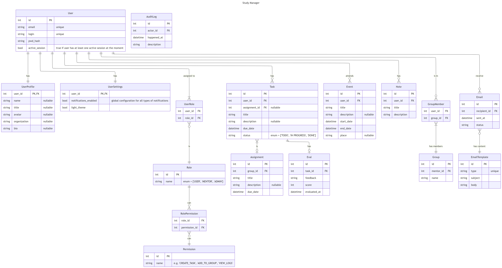

# Student OS — PB138

> An all-in-one hub for university student life, powered by an AI copilot and a first-class teacher-student communication layer.

Built as a university project for PB138 — Web Development Principles, Masaryk University Brno.

---

## What is this?

Student OS is the single app a student opens every morning and a teacher opens before every class. Three things make it different from a plain study tracker:

1. **Everything in one place** — tasks, notes, courses, timeline, and teacher-assigned work unified in a single shell
2. **AI copilot** — an AI that knows your deadlines, workload, and notes, and proactively helps you manage your week
3. **Teacher-student channel** — teachers assign students to courses, publish study materials, create assignments for the whole class, and evaluate submitted work

---

## What it can do

### As a Student

- **Today view** — personalized daily screen: week strip, tasks for today, upcoming deadlines, AI summary of your week
- **Tasks** — personal tasks + subtasks, filter by status/due date/priority/tags; teacher-assigned tasks appear here automatically tagged with the course
- **Courses** — enrolled courses with progress tracking; each course opens a tabbed detail view:
  - _Tasks_ — all tasks linked to this course
  - _Notes_ — notes linked to this course
  - _Materials_ — study materials uploaded by the teacher (links + file uploads)
  - _Evaluations_ — all evaluations for this course with score + feedback
- **Notes** — personal notes organized in folders, linkable to courses; AI can quiz you on a note or answer questions about it
- **Timeline** — calendar view of events and personal deadlines; teacher-assigned deadlines appear here automatically (immutable)
- **AI Copilot** — persistent right-side panel with two modes:
  - _Brief_ — AI-generated daily summary of your tasks, deadlines, and workload
  - _Agent_ — conversational AI with access to your tasks, notes, and courses; can read study material PDFs

### As a Teacher

- **My Courses** — all courses you teach, class roster, count of pending evaluations
- **Assignments** — create assignments for a group, set due date and description; publishing auto-creates one task and one deadline event per enrolled student
- **Evaluations** — grade submitted student work with score + feedback
- **Study Materials** — attach links or upload files to a course; enrolled students see them in the Materials tab
- **Students** — enroll and remove students per course, search by name/email

### Role toggle

A user can hold both Student and Teacher roles (e.g. PhD students). A small pill in the sidebar switches the entire navigation context without logging out.

New users are always **Student** by default. The **Teacher** role is granted exclusively by an Admin via the admin panel — no self-declaration.

---

## How it works

```
Browser
  └── React + TanStack Router (file-based routing)
        ├── Sidebar (role-aware nav) + AI panel strip
        ├── Student screens: Today, Tasks, Courses, Notes, Timeline
        ├── Teacher screens: My Courses, Assignments, Evaluations, Materials
        └── AI Copilot panel (daily brief / agent chat)

ElysiaJS API (Bun)
  ├── /auth        — sync Supabase user to local DB, logout
  ├── /tasks       — CRUD + subtasks + toggle done + eval
  ├── /events      — CRUD events & deadlines
  ├── /notes       — CRUD notes + folders
  ├── /courses     — enroll, course detail, progress, study materials
  ├── /groups      — mentor groups + assignments
  ├── /users       — profile, settings, password
  ├── /admin       — user management, roles, audit logs
  └── /ai          — daily brief, agent chat, note quiz, note chat

PostgreSQL via Supabase (Drizzle ORM)
  └── users, tasks, events, notes, courses, assignments, evals,
      study_materials, audit_logs, ...

Supabase Auth
  └── register, login, email verification, session management

E-infra AI API (university AI infrastructure)
  └── Powers /ai routes — context assembled server-side from user's own data
      Student data is never visible to teachers through AI
```

---

## Key design decisions

- **Soft delete everywhere** — `deleted_at` column, never hard DELETE
- **Audit log on every mutation** — INSERT/UPDATE/soft-DELETE → `audit_logs`
- **Ownership enforced server-side** — users can only read/modify their own data
- **AI context is scoped** — the AI only sees the authenticated user's data
- **Teacher assignments auto-create tasks and deadline events** — publishing an assignment creates one task and one immutable deadline event per enrolled student
- **Role toggle, not separate logins** — one account can hold multiple roles
- **Auth via Supabase** — register/login/verify handled entirely by Supabase; backend verifies JWT via JWKS

---

## Tech Stack

| Layer      | Technology                                     |
| ---------- | ---------------------------------------------- |
| Frontend   | React 18 + TypeScript + Vite + TanStack Router |
| Styling    | Tailwind CSS (dark mode via `class`)           |
| Validation | Zod                                            |
| Backend    | Bun + ElysiaJS + TypeScript                    |
| Database   | PostgreSQL via Supabase                        |
| ORM        | Drizzle ORM                                    |
| Auth       | Supabase Auth (JWT verified via JWKS)          |
| AI         | E-infra API (university AI infrastructure)     |
| Testing    | Vitest + Playwright                            |
| CI/CD      | GitHub Actions                                 |

---

## Setup

```bash
pnpm install
pnpm --filter @pb138/frontend dev   # frontend on http://localhost:5173
bun run dev                          # backend on http://localhost:3001 (from apps/backend/)
```

### Environment variables

**`apps/backend/.env`**
```
DATABASE_URL=...
SUPABASE_URL=...
SUPABASE_JWT_SECRET=...
E_INFRA_API_TOKEN=...
EINFRA_BASE_URL=https://llm.ai.e-infra.cz/v1/
EINFRA_MODEL=llama3.3:latest
```

**`apps/frontend/.env`**
```
VITE_API_URL=http://localhost:3001
VITE_SUPABASE_URL=...
VITE_SUPABASE_ANON_KEY=...
```

### Database

```bash
# From apps/backend/:
bun run db:generate   # generate migration from schema changes
bun run db:migrate    # apply migrations
bun run db:push       # push schema directly (dev only)
bun run src/db/seed.ts        # seed roles, permissions, email templates
bun run src/db/seed-user.ts   # seed demo user data
```

### Run tests

```bash
pnpm --filter @pb138/frontend test       # Vitest unit tests
pnpm --filter @pb138/frontend test:e2e   # Playwright E2E
bun test                                  # Backend unit tests (from apps/backend/)
```

---

## Repository Structure

```
pb138/
├── apps/
│   ├── backend/
│   │   └── src/
│   │       ├── index.ts           # ElysiaJS server entry
│   │       ├── db/
│   │       │   ├── schema.ts      # All table definitions
│   │       │   └── index.ts       # Drizzle client
│   │       ├── routes/            # One file per resource
│   │       ├── middleware/auth.ts # Supabase JWKS verification
│   │       └── services/          # Audit log, AI
│   └── frontend/
│       └── src/
│           ├── routes/            # File-based routing (TanStack Router)
│           ├── components/        # Shared UI components
│           ├── hooks/             # Custom hooks
│           └── lib/               # API client, auth context, i18n
├── docs/
│   └── analysis/
│       ├── diagrams/              # ERD (erd.md), use case (use-case.puml)
│       └── requirements/          # Feature requirement specs
├── docker-compose.yml
└── .github/workflows/ci.yml       # lint → test → build → e2e
```

---

## Team

| Name               | UCO    |
| ------------------ | ------ |
| Peter Perveka      | 564577 |
| Valéria Kvaššayová | 550435 |
| Jaroslav Svajčík   | 564578 |
| Martin Boucník     | 564157 |

---

## Entity-Reationship Diagram


> Source file: [erd.md](./docs/analysis/diagrams/erd.md) (Mermaid)
