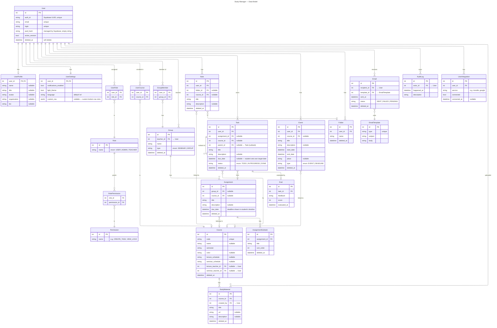

<!-- 
For preview in VSCode:
1. get extension "Markdown Preview Mermaid Support"
2. right click -> "Open Preview" or Ctrl + Shift + V
Or paste into https://mermaid.live for export as PNG/SVG.
-->

```mermaid
---
title: Study Manager — Data Model
config:
    layout: elk
---
erDiagram
    User {
        int id PK
        string auth_id "Supabase UUID, unique"
        string email "unique"
        string login "unique"
        string pwd_hash "managed by Supabase, empty string"
        bool active_session
        datetime deleted_at "soft delete"
    }

    UserProfile {
        int user_id PK, FK
        string name "nullable"
        string title "nullable"
        string avatar "nullable"
        string organization "nullable"
        string bio "nullable"
    }

    UserSettings {
        int user_id PK, FK
        bool notifications_enabled
        bool light_theme
        string language "default 'en'"
        jsonb custom_nav "nullable — custom bottom nav slots"
    }

    %% RBAC
    Role {
        int id PK
        string name "enum: USER | ADMIN | TEACHER"
    }

    UserRole {
        int user_id FK
        int role_id FK
    }

    Permission {
        int id PK
        string name "e.g. CREATE_TASK, VIEW_LOGS"
    }

    RolePermission {
        int role_id FK
        int permission_id FK
    }

    %% Courses
    Course {
        int id PK
        string code "unique"
        string name "nullable"
        string semester
        string color "nullable"
        string lecture_schedule "nullable"
        string seminar_schedule "nullable"
        int lecture_teacher_id FK "nullable → User"
        int seminar_teacher_id FK "nullable → User"
        datetime deleted_at
    }

    UserCourse {
        int user_id FK
        int course_id FK
    }

    StudyMaterial {
        int id PK
        int course_id FK
        int created_by FK "→ User"
        string title
        string url "nullable"
        string description "nullable"
        datetime deleted_at
    }

    %% Groups & Assignments
    Group {
        int id PK
        int teacher_id FK "→ User"
        string name
        string type "enum: SEMINAR | GROUP"
        datetime deleted_at
    }

    GroupMember {
        int user_id FK
        int group_id FK
    }

    Assignment {
        int id PK
        int group_id FK "nullable"
        int course_id FK "nullable"
        string title
        string description "nullable"
        datetime due_date "deadline shown in student's timeline"
        datetime deleted_at
    }

    AssignmentSubtask {
        int id PK
        int assignment_id FK
        string title
        int sort_order
        datetime deleted_at
    }

    %% Tasks & Evaluations
    Task {
        int id PK
        int user_id FK
        int assignment_id FK "nullable"
        int course_id FK "nullable"
        int parent_id FK "nullable → Task (subtask)"
        string title
        string description "nullable"
        datetime due_date "nullable — student sets own target date"
        string status "enum: TODO | IN PROGRESS | DONE"
        datetime deleted_at
    }

    Eval {
        int id PK
        int task_id FK
        string feedback
        int score
        datetime evaluated_at
    }

    %% Events
    Event {
        int id PK
        int user_id FK
        int course_id FK "nullable"
        string title
        string description "nullable"
        datetime start_date
        datetime end_date
        string place "nullable"
        string type "enum: EVENT | DEADLINE"
        datetime deleted_at
    }

    %% Notes & Folders
    Folder {
        int id PK
        int user_id FK
        string name
        datetime deleted_at
    }

    Note {
        int id PK
        int user_id FK
        int folder_id FK "nullable"
        int course_id FK "nullable"
        string title
        string description "nullable"
        datetime deleted_at
    }

    %% Notifications & Audit
    EmailTemplate {
        int id PK
        string type "unique"
        string subject
        string body
    }

    Email {
        int id PK
        int recipient_id FK "→ User"
        int template_id FK "→ EmailTemplate"
        datetime sent_at
        string status "SENT | FAILED | PENDING"
        datetime deleted_at
    }

    AuditLog {
        int id PK
        int actor_id FK "→ User"
        datetime happened_at
        string description
    }

    UserIntegration {
        int id PK
        int user_id FK
        string service "e.g. moodle, google"
        bool connected
        datetime connected_at "nullable"
    }

    %% ── Relationships ──────────────────────────────────────────

    User ||--o| UserProfile : "has"
    User ||--|| UserSettings : "has"
    User ||--o{ UserRole : "assigned"
    UserRole }o--|| Role : "is"
    Role ||--o{ RolePermission : "grants"
    RolePermission }o--|| Permission : "is"

    User ||--o{ UserCourse : "enrolled in"
    UserCourse }o--|| Course : "is"
    Course ||--o{ StudyMaterial : "has"
    User ||--o{ StudyMaterial : "uploaded"

    Assignment ||--o{ AssignmentSubtask : "has"

    User ||--o{ Group : "teaches"
    User ||--o{ GroupMember : "member of"
    GroupMember }o--|| Group : "has"
    Group ||--o{ Assignment : "has"
    Assignment }o--o| Course : "belongs to"

    User ||--o{ Task : "owns"
    Task }o--o| Assignment : "from"
    Task }o--o| Course : "for"
    Task ||--o{ Task : "subtask of"
    Task ||--o| Eval : "evaluated by"

    User ||--o{ Event : "has"
    Event }o--o| Course : "linked to"

    User ||--o{ Folder : "has"
    User ||--o{ Note : "has"
    Note }o--o| Folder : "in"
    Note }o--o| Course : "linked to"

    User ||--o{ Email : "receives"
    Email }o--|| EmailTemplate : "uses"
    User ||--o{ AuditLog : "actor"
    User ||--o{ UserIntegration : "has"
```
