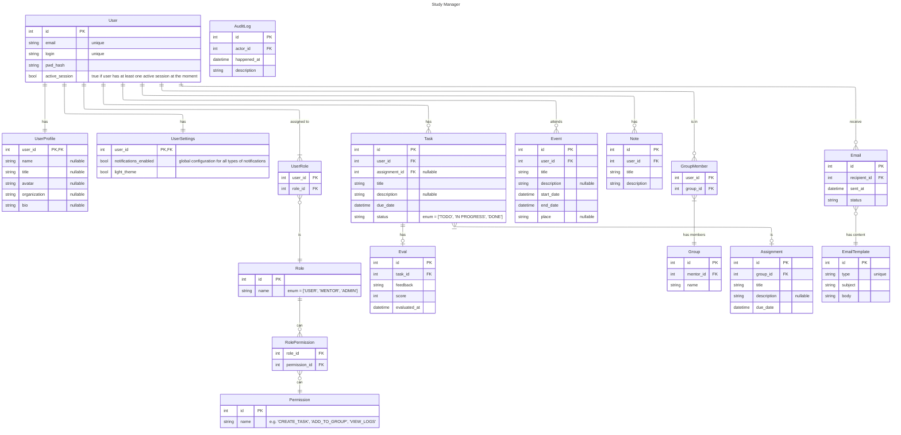

<!-- 
For preview in VSCode:
1. get extension "Markdown Preview Mermaid Support"
2. right click -> "Open Preview" or Ctrl + Shift + V
-->

<!-- Might add later:
- one task shared among multiple users (that is why Assignment already exists)
- group events
- pomodoro timer
- TODO: discuss subtasks
-->

    