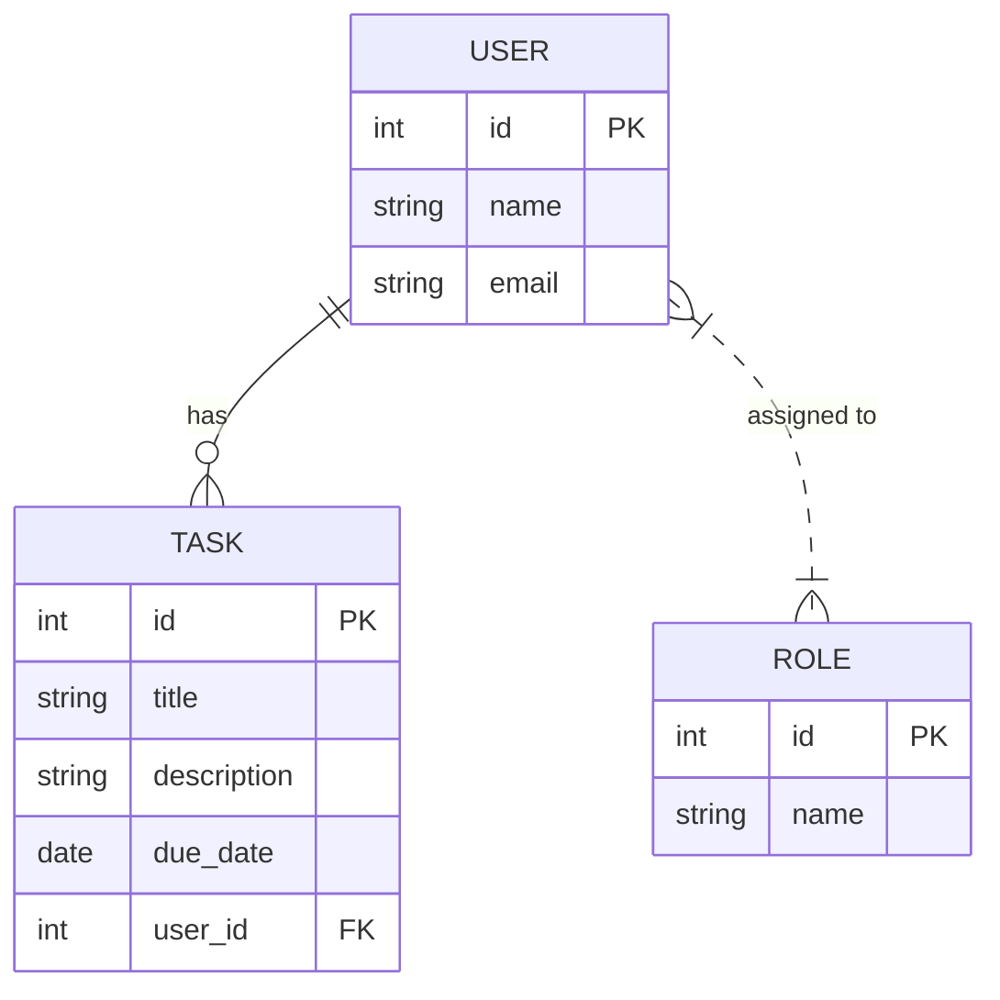

<!-- 
For preview in VSCode:
1. get extension "Markdown Preview Mermaid Support"
2. right click -> "Open Preview" or Ctrl + Shift + V
-->

```mermaid
erDiagram
    USER {
        int id PK
        string name
        string email
    }

    TASK {
        int id PK
        string title
        string description
        date due_date
        int user_id FK
    }

    ROLE {
        int id PK
        string name
    }

    %% Relationships
    USER ||--o{ TASK : "has"
    USER }|..|{ ROLE : "assigned to"
```
    